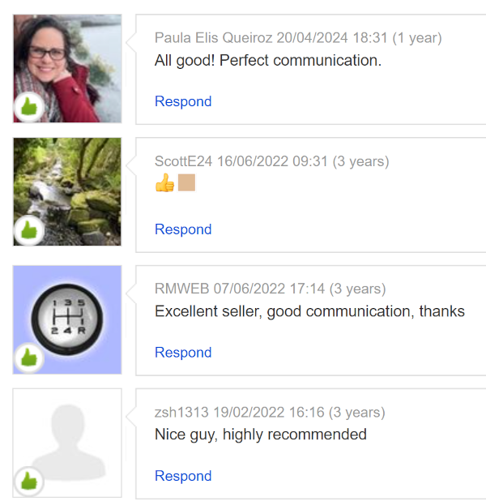

Welcome to my digital graveyard of test assignments -- gravestones to the days I wasted on corporate screenings.
From microservice game servers to asyncio coffee shop banter, each project is a testament to my grit.

These companies, with their assembly-line hiring, demand you bleed hours on tasks while refusing a 15-minute chat to gauge your skills.

Dive into my saga of snubbed brilliance—clever solutions, savage rejections, and zero regrets. Time wasted: Countless hours. Lessons learned: Priceless.

* [EPAM Codility & interview farce](epam) for EPAM.
  Recruiter with Ukrainian surname swore the three Codility tests were “specifically designed for the Azure role” (they weren’t). Spent a full hour, scored 100%. Role said Azure, team only does AWS. Shared screen to show real CDK work — fine. Shared screen again when ordered to demonstrate LLM use — suddenly “sensitive information”. Cheeky final interviewer tried to squeeze self-criticism, failed, then the rejection arrived. Time wasted: one hour of pure theatre + interviews. Claude was still the smartest person in the room.

* [The game server using microservice architecture](digit) for Digit Game Studios.

It took 9 hours to complete, but technical verdict was:
"Lack of knowledge on transactions/atomicity".

* [The REST API endpoints for creating/serving recipes](dropkitchen) for getdrop.com

The application is working, but they have found "someone better", lol.

* [Publisher/Subscriber service on Erlang](celtra) for Celtra

It uses Cowboy web frwmework with mnesia db in order to receive and server messages using websockets.
"A different skill set needed".

* [Log parser](./tree/master/radarservices) for RadarServices.com

Their response: "our requirements are very high". This is funny, as the script is just a log parser.

* [To implement the UK post code validation library](.scurri) for scurri.com

The task was to implement a production-ready library for UK post code validation.
Of course a reasonable programmer would use one of many existing libraries.

* [Real-time, asyncio-based conversational AI simulation between a coffee shop guest and employee.](hiauto) for hi.auto

It took about an hour and resonse was:
> After a check with the team, we decided not to proceed with your candidacy for this position.
> They clearly saw from the recording that the assignment you uploaded after 5 minutes included the exact menu and prices listed in the instructions of our assignment.

*My observations:*

1. Team don't care if you waste 3 hours; they won't talk to you before you invest 3 hours of your time.
2. They clearly "saw" something they were uncertain about, but they didn't want to risk wasting their time with me. Yet they had no issue with me spending 3 hours on their assignment.
3. It wasn't an AI assignment, but rather a general asyncio Python exercise. This was a typically misleading task, with the company claiming they didn't have anyone who could assess candidates' skills during a 15-minute phone call.

* [AWS CDK infrastructure project enabling retrieval augmented generation for universities](impressitio) for impressit.io

It was a complete serverless architecture with API Gateway, containerized services on Fargate, OpenSearch for RAG capabilities, RDS storage, and robust security features.

They did not care to respond after I provided code.

* [Document management web application assessment with a Django/Python backend and React frontend](propylon) for propylon.com

I delivered required implementation with file upload and retrieval bash script. Server side used a custom FileModel that organizes files into a hierarchical directory structure based on FK IDs.

No response since then.

**StellarTech's Recruitment Farce: 3 Hours Flushed**
Epic corporate nonsense. Here's how it went: HR intro, 1-hour technical interview, 40-minute Python test (100% coding score, naturally), and a 30-minute client technical chat. Then came the take-home test, which included a system design essay, architecture fix, and Python circuit simulation.

After **two weeks** of silence (hiring manager was "partially unavailable"), they wrote that they **adored** my technical skills but rejected my candidacy due to a "communication style mismatch" — a laughable excuse, considering the reviews from people who actually met me:

This criticism comes from folks too incompetent to properly assess expertise in a 15-minute call, something I've successfully done with candidates before. Total time wasted: **3 hours**.

**Tombstone: SilkRiever’s Spring-Boot Sham**
Time Wasted: 4 hours coding, 2 hours groveling

SilkRiever, led by loyal time-wasting minions Amish and Claude, unleashed a multi-tenant Spring-Boot trial.

One day before interview they wrote:
``
I wanted to share with you the pre-requisites for the session.  Please make sure you have the following requirements met:
You will be developing a solution in Java, so you should have your preferred Java IDE at your disposal.
You will need access to a postgres database that you can read/write to.
``
So I brought a prepped project to save their precious time: pom.xml with Hibernate, openapi-generator-maven-plugin, etc.

During the interview, I adapted it like a coding ninja, but Amish and Claude whined that I didn’t build it from scratch
in their unrealistic two-hour cage match. They nitpicked “debugging difficulties” and claimed they couldn’t assess
my skills—despite watching me adapt the project from the start. These minions happily burned two hours
I could’ve spent with family, proving they’d rather waste my time than have a quick chat to confirm I’m an expert in coding.

SilkRiever’s Amish and Claude are black belts in wasting candidates’ time, dangling fake opportunities while dodging real conversations.
I even prepared architecture diagram for [improving their messy system](./tree/master/silkriver) they complained about
