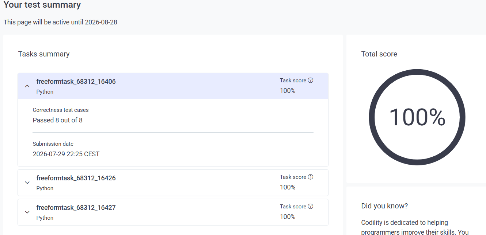

**EPAM: Digital Graveyard Entry #N**

Welcome to another tombstone in the corporate screening cemetery.
This one is dedicated to EPAM — the undisputed heavyweight champions of wasting other people’s time while pretending to be serious about hiring.

### The EPAM Experience (abridged)

- Recruiter Olena Dorichenko (Ukrainian surname) called and carefully managed my expectations: “We have a very long and complicated interview process, consisting of 6 hours.” Being from Ukraine myself, I trusted the girl with the familiar surname. Reality turned out to be roughly 3 hours.
- For the “Senior Cloud Platform Engineer (Azure) role for EPAM Spain” she insisted the three Codility tests were specifically designed for that exact role and mandatory. I believed her and spent a full hour solving them. It was a pure lie — those tests were never required for the position at all.
- The tests themselves were pure comedy (and I scored **100%** on all of them):

  - [“Find Duplicate File in System”](task-find-duplicate-files.md) — because nothing says senior cloud engineer like parsing directory strings.
  - [“Log Analytics System”](task-log-analytics.md) — synthetic log parsing with severity filters. Real cloud engineers live for this.
  - [“Feature Toggle System”](task-feature-toggle-system.md) — because every Azure platform interview must include a feature-flag toy problem.

- On the live coding round I was asked to proof-read code that Claude had generated. I found every issue faster than they expected. Claude was still the smartest participant in that room.
- Role description said Azure. The people I actually spoke to admitted they only work with AWS and none of them had Azure experience. I shared my screen and showed a real CDK project from previous work. That demonstration was perfectly acceptable — it helped me reach the final stage with the top hypocrite of their empire of sadness.
- Final round with the cheeky manager (Evgenii, Russian name, careful English so the accent stayed hidden). He tried forcing me to confess I was lazy and squeezed for any negative self-comment. When that failed, he ordered me to share my screen and demonstrate how I use an LLM. I did exactly as asked. Later Olena wrote that the same Evgenii claimed I had “shared sensitive information.”

Apparently, in EPAM’s moral universe, showing a few lines of LLM-generated text on a screen you were ordered to share is a graver security breach than posting a Senior Azure Cloud role while the entire team still thinks the Azure portal is a fancy screensaver.

### Time wasted
One solid hour of Codility that was never needed + interviews + emotional labour.
Value delivered by EPAM in return: zero.

### Lessons reinforced
- EPAM does not value your time.
- EPAM will lie about process length, about tests being “specifically designed for the role,” and about the actual technology stack.  
- EPAM will happily watch you share a CDK project, then accuse you of leaking “sensitive information” the moment you share the next screen they themselves demanded.  
- Claude remains smarter than most of their interviewers.  
- Public chatter on X and elsewhere about EPAM’s recruitment circus (ghosting, bait-and-switch, endless assessments) is not exaggerated.

Another fine addition to the collection of corporate farces.  
No regrets. Just another gravestone.
