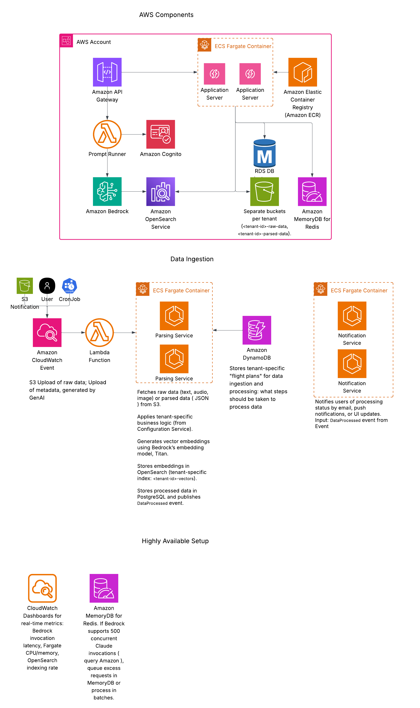

Oh, behold my latest masterpiece, a Spring-Boot multi-tenant synthetic app I developed on a weary Friday evening.
The task:  Build a multi-tenant app with a tenant-management service, an asset-management service.

Architecture diagram that Amish and Claude minions refused to disccussing with me:

Application 

Develop a Spring-Boot, multi-tenant application where each tenant can have an arbitrary organizational hierarchy.  See an example of a tenant and it’s organizational hierarchy below. 

 

You application should define an tenant-management and asset-management service.   

Tenant-Management Service 

The tenant-management service allows us to define/manage tenants and the organization hierarchy under a tenant.  This service should incorporate a cache to avoid hitting the DB while making sure that you don’t get stale data. 

Asset-Management Service 

Think of an asset as something like configurations that are delivered at a System level but can be refined at a tenant and organization level.   

Build an asset-management service that manages Asset entities.  An asset consists of a name, description, and org-code.  The resolution of an asset involves finding the most refined asset with a given name.  For example, a user at the “East” organization above will try and find the named asset in the following order: East à US à Company-X à System. 

When refining/updating an asset, the asset is always saved/updated at the user’s org-code level, regardless of where it was loaded from.  An asset can only be deleted if it lives at the user’s org-code level, else it should throw an exception. 

Normally a user’s current org-code would be taken from a security context.  However, for the purpose of this exercise, the org-code will be passed as a parameter to the methods of this service. 

User Interface 

Build a react component that allows for the management of tenants and tenant hierarchies.
